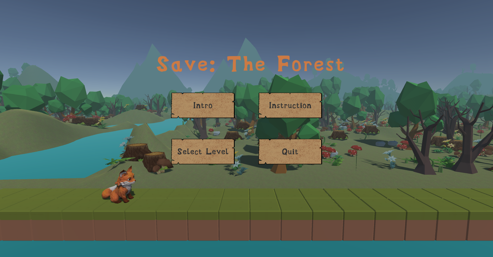

# Save: The Forest

A game made in Unity

### Technologies
Project is created with:
* Unity 2022.1.9f1 
* Ipsum version: 2.33
* Ament library version: 999

### Game Summary

The game **_Save: The Forest_** is a 2.5D Adventure game made in Unity. The story of the game starts with a forest that has been polluted due to the ongoing industrialisation and the _"Heart of The Forest"_ thereby has lost its vitality to support the thousands of lives residing in the forest. The player would need to control the warrior, Fox, to take on a journey of reviving the forest by crossing through obstacles, defeating enemies and finally collecting the elements including Wood, Water and Soil at the end of each level. 

###  How To Play The Game

The player can press keys `"A"` and `"D"` to move the character horizontally, `"SPACE"` to jump and `click` on the mouse to aim and shoot a stone. There exist enemies that cannot be killed, in which case the character needs to jump over them.

The player aims to collect all the stars at the end of each level to win the game. If the character is killed by obstacles or enemies, the current level will restart automatically. In each level, the pause menu can be triggered by pressing the key `"Esc"`, which provides options to go back to the main menu and quit the game. Finally, The player can only reach the next level by completing the current level, and the forest will only be saved after the fox has collected all the elements.

### Run the game locally
Open in Unity 2022.1.9f1 
Main entry: "Start Scene"
For the best visualisation of the game, we would recommend to switch the resolution aspect ratio to Full HD(1920 * 1080). 

### References

1. "Heart of The Forest" shader:  <https://zhuanlan.zhihu.com/p/443595977>
2. Outline shader(1): <https://www.laowangomg.com/?p=712#2>
3. Outline shader(2): <https://blog.csdn.net/weixin_47652005/article/details/120300175?ops_request_misc=&request_id=&biz_id=102&utm_term=shader%E9%BB%91%E8%89%B2%E6%8F%8F%E8%BE%B9&utm_medium=distribute.pc_search_result.none-task-blog-2~all~sobaiduweb~default-0-120300175.142^v59^pc_search_tree,201^v3^add_ask&spm=1018.2226.3001.4187>
4. Apply multi material: <https://blog.csdn.net/jennyhigh/article/details/81811316>
5. How to learn procedurally generate: <https://www.youtube.com/watch?v=XpG3YqUkCTY>
6. Randomly generate terrain: <https://www.youtube.com/watch?v=64NblGkAabk&list=PLrMEhC9sAD1zprGu_lphl3cQSS3uFIXA9&index=2>
7. Random generate items(1): <https://www.youtube.com/watch?v=O9J_Cfl6HzE&list=PLrMEhC9sAD1zprGu_lphl3cQSS3uFIXA9&index=16>
8. Random generate items(2): <https://www.youtube.com/watch?v=bIM3VAiZHeQ>

Contributors:
* Bruce Zhu
* Zhikai Wu
* Zilun Li
* Tao Yun

